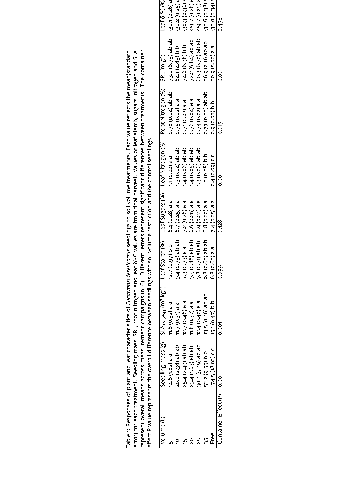
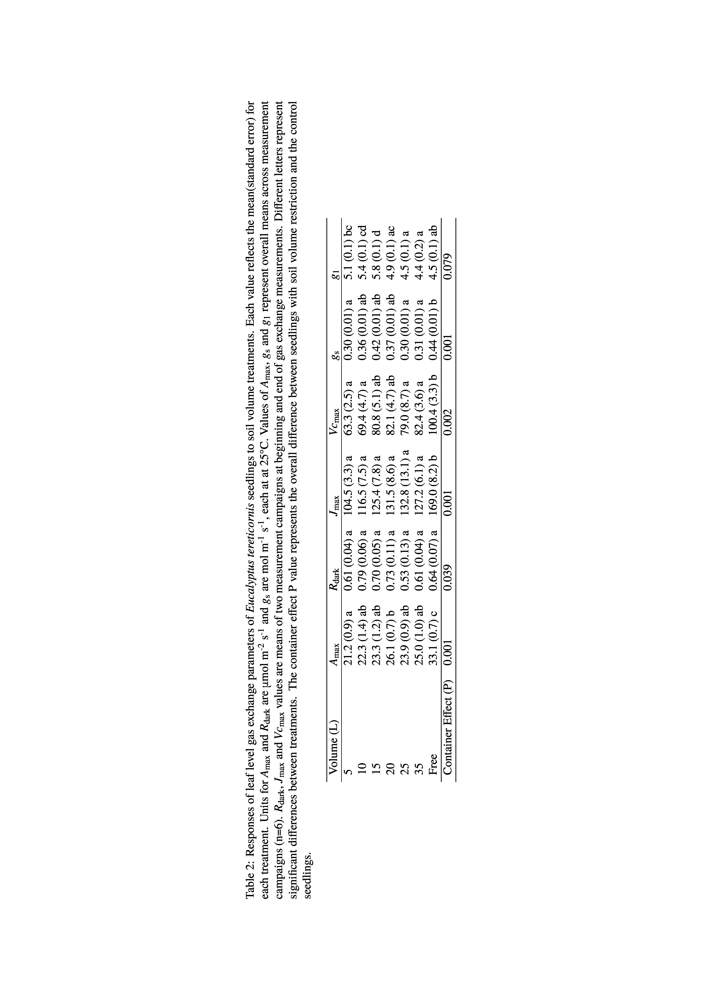
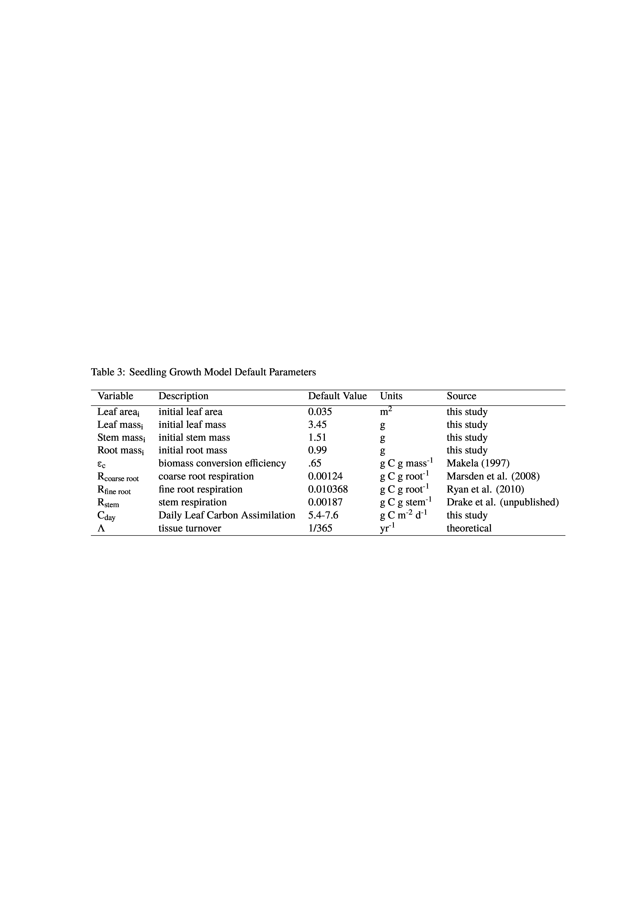

\
Courtney E. Campany^1^, Belinda Medlyn^1^, Remko A. Duursma^1^.

\
^1^ Hawkesbury Institute for the Environment, University of Western Sydney, Locked Bag 1797, Penrith, NSW, Australia

\
*Corresponding author*: 
Courtney Campany
E: courtneycampany@gmail.com


```{r, results="asis", echo=FALSE, warning=FALSE}
library(knitr)
opts_knit$set(root.dir = '../')
```

```{r global data/sourcing, echo=FALSE, message=FALSE, warning=FALSE}
# Two useful packages for printing numbers, accessing content of objects.
library(broom)
library(reporttools)
# Set Flag to include figures in text or not.
includeFigs <- TRUE

source("functions and packages/startscripts.R")
source("functions and packages/gamplotfunctions.R")

```

```{r, echo=FALSE}
allomfig <- "1"
airvarsfig <- "2"
allocfig <- "3"
asatfig <- "4"
achemfig <- "5"
massmodelfig <- "6"
massmodelfig2 <- "S1"
```


# Abstract {.unnumbered}

Interpreting limitations to plant growth requires understanding of the balance between carbon (C) source and sink activity. This study used manipulations of soil volume to test how growth is coupled to physiology, carbon allocation, and sink activity in *Eucalyptus tereticornis* seedlings. We grew individual seedlings in a large range of container sizes and planted containers flush to the soil alongside naturally sown ('free') seedlings. We developed a seedling growth model that utilized leaf photosynthesis rates (A) to allocate daily C uptake towards mass growth of stems, leaves and roots. Reduced soil volume was expected to induce rapid negative effects on growth and physiology compared to free seedlings. It was hypothesized that the soil volume effect would be largest in the smallest containers, negatively impacting mass partitioning belowground. An accumulation of leaf non-structural carbohydrates, resulting from reduced belowground sink strength, was expected to correlate to reductions in photosynthetic capacity. We observed a negative effect of contatiner volume on aboveground growth soon after the experiment started. Although growth was consistently different across soil volumes, dry mass partitioning to leaves, stems and roots was unchanged after 120 days. Photosynthetic capacity was significantly reduced in containers compared to free seedlings, and was related to both leaf nitrogen content and starch accumulation. We then asked whether the observed reductions in A explained the observed differences in seedling biomass. We found that although belowground sink limitation resulted in down regulation of A, these reductions were not large enough to explain observed growth responses. Thus, as A and growth were not tightly coordinated, an unaccounted for pool of non-biomass C resulted in seedlings with soil volume restriction. These results highlight the need to further utilize mass balance approaches when evaluating plant C allocation and confirms that A and growth are not always directly related.

# Keywords {.unnumbered}
photosynthesis, growth, sink regulation, carbon allocation, soil volume

# Introduction

Understanding plant growth and its relationship to C assimilation requires knowledge of the mass balance that must be achieved between C uptake and subsequent allocation to growth, storage, and respiration. As woody plants have highly integrated systems of competing carbohydrate sinks [@kozlowski1992carbohydrate], growth should principally depend on the allocation of photosynthate among different tissues and organs. At long enough time scales photosynthesis (A) and growth must be coordinated to maintain mass balance, however, at shorter temporal scales growth is not necessarily limited by the availability of recent photosynthate. This has led to the current debate on how strongly plant growth is controlled by either source or sink activity. Consequently, plant growth cannot always be simply determined by the photosynthesis rate, making it complex to understand and challenging to model [@fourcaud2008plant]. Despite a wealth of studies, large uncertainties still remain regarding the coordination of C supply and growth of woody species.

\
In woody species, the coordination of A and growth has been studied with manipulations of C source activity. Examples included elevated CO~2~ experiments, for example FACE [reviewed in @ainsworth2005have], and partial defoliation experiments. Elevated CO~2~ has been shown to increase A [@drake1997more; @ainsworth2007response] and across four FACE experiments this resulted in a stimulation of 23 % in forest biomass production [@norby2005forest]. Evidence from a wide range of elevated CO~2~ experiments, however, also reveals that even with an average photosynthetic enhancement of over 30 %, the biomass growth rate only increases by around 10 % [@kirschbaum2011does]. In partial defoliation experiments, increases in A of the remaining foliage are commonly shown, yet are attributed to various mechanisms, including reduction in end product inhibition [@iglesias2002regulation; @zhou2003changes; @handa2005test], enhanced biochemical activity [@ovaska1993b;@layne1995end], increased stomatal conductance [@layne1995end], enhanced leaf nutrient status [@turnbull2007increased], and regulatory sugar signaling [@eyles2013whole]. However, increases in A in defoliation experiments did not always produce increased growth due to reductions in meristem sink strength [@palacio2012fast], C limitation to mycorrhizal colonization [@markkola2004defoliation], or an overall decrease in whole plant C gain [@ovaska1993a]. These manipulations of C source activity expose unresolved issues with how changes in A do not always infer similar responses in growth.

\
Alternatively, manipulating plant tissue C sinks is often used to investigate the correlation of A and growth. This is because metabolic signaling networks, relaying information on C and N status of different tissues, can regulate photosynthetic activity [@paul2001sink]. If sink inhibition of A occurs, a close coordination between declines in A and growth should be expected. Whether photosynthetic down regulation is evident in woody species has been tested through fruit removal, phloem girdling, and low temperatures. In these studies, down regulation of A was frequently correlated to carbohydrate accumulation resulting from reduced tissue sink strength  [@iglesias2002regulation;@hoch2002altitudinal; @urban2007girdling; @haouari2013fruit]. However, reductions in A were also attributed to biochemical limitations prior to carbohydrate accumulation [@nebauer2011photosynthesis], irreversible photo-oxidative damage [@duan2008photosynthetic], and stomatal limitation [@li2005photosynthesis]. These mixed results are not surprising as we still know little about the pathways in which plants achieve balance between assimilation, storage, and growth across temporal scales [@smith2007coordination]. As these manipulations likely impact source as well as sink activity simultaneously, affect water transport, are very extreme, or are specific to the occurence large fruiting sinks, they tell us little about source-sink coordination in typical growing conditions for woody species.

\
An alternative experimental approach is to reduce belowground C sink strength in tree seedlings by manipulating rooting volume, by varying the container size. The advantage of this approach is that it allows a large range of treatment levels, can be easily compared to naturally planted seedlings and may mimic natural conditions as seedlings compete for space or reach bedrock. Seedlings undergo many physiological and morphological changes in response to rooting volume, including biomass partitioning, A, water relations, nutrient uptake and respiration [@nesmith1998effect;@poorter2012pot and references therein]. Inadequate rooting volume may decrease C sink strength by progressively restricting root growth [@thomas1991root].  Container size studies frequently exhibit photosynthetic down-regulation, likely as a result of sink limitation [@arp1991effects; @mcconnaughay1991physical; @gunderson1994photosynthetic; @sage1994acclimation; @maina2002intra; @ronchi2006growth]. A meta-analysis by Poorter et al. [-@poorter2012pot] concluded that A is the process likely to be the strongest affected by pot size and may best explain the effects on biomass seen in the large number of studies where containers are used. This conclusion arises because plants grown in small containers are shown to accumulate leaf starch while having lower C exchange and assimilate export rates [@robbins1988effect]. However, evidence in support for a trade-off between C storage and growth in trees is, to date, inconclusive [@palacio2014does]. Based on these previous studies, using container size as a sink-strength manipulation can be used to empirically test the extent to which growth and A are coordinated.

\
This study utilizes a novel field design to investigate the coordination between growth and A in *Eucalyptus tereticornis* Sm. seedlings, by manipulating container size and thus rooting volume. Seedlings were maintained under well watered conditions in order to isolate the effect of restricted soil volume. We used freely-rooted seedlings as a control for the container size treatments. Empirical results were combined with a simple plant growth model to simulate seedling growth with a C mass balance approach, which was then compared to observed harvested seedling mass. The model used whole-plant C gain, scaled from instantaneous rates of leaf A, to quantify seedling dry mass production over the 120 day experiment.

\
Our hypotheses were as follows:
\
1). The manipulations of container size were expected to induce a belowground sink limitation compared to free seedlings. We hypothesized that declines in seedling growth would be largest in the smallest containers.

2). As the finite pool of rooting volume and soil nutrients will decline faster in trees growing in small containers, we expected changes in partitioning to fine root mass to be magnified with decreasing container size.

3). Reduced sink strength was expected to lead to accumulation of leaf non-structural carbohydrates, and a resulting downregulation of A. We therefore expected a correlation between carbohydrate accumulation and photosynthetic capacity as a function of soil volume.

4). Last, observed seedling mass was expected to correspond to growth model mass predicted from a simple C balance model taking into account measured rates of photosynthesis.


# Materials and Methods

## Experimental design
This experiment was located at the Hawkesbury Forest Experiment site in Richmond, NSW, Australia. Plots were located in an open cover paddock that was converted from native pasture grasses. Top soils at this site are an alluvial formation of low-fertility sandy loam soils (380 and 108 mg kg^-1^ total N and phosphorus respectively) with low organic matter (0.7 %) and low water holding capacity. At this site a soil hard layer exists at ~1.0 m with a transition to heavy clay soils. The climate for the region is classified as sub-humid temperate. 

\
*Eucalyptus tereticornis* seedlings, 20 weeks old and approximately 40 cm tall in tube stock, were chosen from a single local Cumberland plain cohort. Six additional seedlings were harvested before planting to measure initial leaf area and dry mass of leaves, stems and roots.Previous experiments have confirmed that species with tap roots (similar to *E. tereticornis*) use the center of the container as the medium for thick roots leaving the periphery of the soil as the most active sites for fine root proliferation [@biran1980a; @biran1980b]. By using a species with tap root growth and manipulations of container length rather than width, we believed that a more realistic test of growth inhibition through constrained soil volume would be achieved. 

\
Six container volumes were used ranging from 5 L to 35 L, with a 22.5 cm diameter, and lengths ranging from 15 to 100 cm. Containers were constructed of PVC pipe and were filled with local top soil (described above). Soil in each container was packed to achieve a target soil bulk density that matched local soil conditions of 1.7 g m^-3^. A Imidacloprid (BAYER CropScience) insecticide tablet was planted 5 cm below the roots of each seedling. Containers were planted flush with the soil surface inside metal sleeves, designed to minimize excess air space between the container and outside soil while also allowing for container removal. This allowed for soil temperatures in containers to reflect conditions of naturally planted ('free') seedlings. Each experimental block (n=7) contained a complete replicate set of six container volumes as well as one free seedling, with 1 m^2^ spacing. For each free seedling, used as the control, a 1 m^2^ subplot was excavated to the hard layer and replaced with the same soil used in each container. A border of root exclusion material was buried 0.25 m deep and extended 0.25 m above the ground surface around each subplot to exclude local vegetation.

\
Plants were watered weekly or when needed to maintain soil moisture at field capacity (13-15 %). Drain systems were built into each pot to prevent pooling of water in containers before root expansion, from reduced root uptake, or from large rainfall events. Pooling of water could lead to an anaerobic environment around the root that could hinder the uptake of water through reduced root conductance [@poorter2009causes], an undesired experimental artifact. A collection compartment in the bottom of containers, containing gravel covered by root exclusion mesh, was used to collect excess water for 20, 25, and 35 l containers. Plastic tubing (6 mm diameter) was inset into the gravel layer and extended through the top of the container. A lysimeter pump was then used to suction excess water, through the tubing, as needed. For small containers (5, 10, and 15 L) a simple bottom plug was used to drain excess water from the gravel compartment. 

## Growth and morphology metrics
Seedlings were planted in summer (January 21^st^ 2013) and stem height, diameter at 15 cm and leaf count were measured weekly thereafter. Once the growth rate of individual plants had significantly declined a full biomass harvest was completed abd the experiment ended (May 21^st^ 2013). Dry mass of leaves, stems, roots and total leaf area (LI-3100C Area Meter; LI-COR, Lincoln, NE, USA) were measured for each seedling. Mean individual leaf area for each harvested seedling was calculated by dividing total measured leaf area by total leaf count of only fully expanded leaves. Mean individual leaf area was then used to interpolate total seedling leaf area through time with weekly leaf counts. Root mass was collected by removing the roots system and passing soil from each container through a 1 mm sieve, washing, separating into fine and coarse roots (<2 mm and >2 mm diameter, respectively) and then drying to a constant mass. Roots from the free seedlings were collected by excavating each 1 m^2^ subplot to the hard layer and keeping only roots within the subplot. 25 g fresh weight subsamples of washed fine roots were analyzed, using WhinoRhizo software (Regent Instruments Inc., Quebec, QC, Canada), for specific root length (SRL, m g^-1^).

## Photosynthetic parameters
Leaf gas exchange measurements were performed fortnightly at saturating light (A~sat~) and saturating light and [CO~2~] (A~max~) on new fully expanded leaves. Measurements were initiated only after sufficient new leaf growth occurred (March 05^th^, 2013), approximately 6 weeks following planting, and continued until the biomass harvest. Leaf level gas exchange was measured with a standard leaf chamber (2 x 3 cm) equipped with blue-red light emitting diodes using a portable gas exchange system (LI-6400, LI-COR, Lincoln, NE, USA). A~sat~ measurements were made at PPFD of 1800 $\mu$mol m^-1^ s^-1^ and [CO~2~] of 400 $\mu$l l^-1^ and A~max~ with [CO~2~] of 1600 $\mu$l l^-1^ and PPFD of 1800 $\mu$mol photons m^-1^ s^-1^. This choice of light level to achieve light saturation is consistent with other studies on *Eucalyptus* species [@kallarackal1997ecophysiological;@pinkard1998photosynthetic;@crous2013photosynthesis;@drake2014capacity]. These measurements were conducted during midday (10:00-14:00 h) with leaf temperature maintained at 25 &deg;C. After CO~2~ and water vapor flux values stabalized in the leaf chamber, net CO~2~ assimilation rate and stomatal conductance (g~s~) were logged 5 times and averaged for both A~sat~ and A~max~. 

\
Photosynthetic CO~2~ response (AC~i~) curves were measured at 25 &deg;C on a random subset of each container size (n=3) after new leaves were first produced (March 13-14^th^, 2013) and prior to the final harvest (May 14-15~th~, 2013). Each AC~i~ curve was started at the reference [CO~2~] of 400 $\mu$l l^-1^ and then consisted of 12 additional steps from [CO~2~] of 50 to 1800 $\mu$l^-1^ at 25 &deg;C at saturating light (above). From these curves the photosynthetic parameters, J~max~ and Vc~max~, were quantified using the biochemical model of [@farquhar1980biochemical] and fit with the 'plantecophys' package [@Duursma2014] in R [@RDevelopmentCoreTeam2011].

\
Leaf dark respiration rates (R~d~) was measured on each seedling during the same dates as AC~i~ curves. Freshly detached leaves were collected at least 1 hour after sundown and placed inside a conifer chamber attached to the Licor 6400. Measurements were taken at a reference [CO~2~] of 400 $\mu$l l^-1^ while leaf temperature was maintained at current ambient conditions. Reported values of R~d~ are standardized rates at 25 &deg;C using a Q10 value (1.86) developed for these seedlings in a separate experiment (Drake et al. unpublished). Leaf area and dry mass were recorded for each leaf during gas exchange campaigns.


## Leaf water potential
Predawn ($\Psi$~pd~) and midday ($\Psi$~l~) leaf water potentials were measured for each seedling using a PMS 1505D pressure chamber (PMS Instruments, Albany, OR, USA) on fully expanded leaves during the same time period as AC~i~ and R~d~. Leaves were detached and immediately stored inside foil covered bags before water potential measurements were performed. $\Psi$~pd~ was measured before sunrise and $\Psi$~l~ at midday 13:00-14:30 h. These measurements were used as a measure of static water stress on the seedlings [@sellin1999does] and to ensure that the bulk soil water availability was high enough for plants to avoid water stress as they became larger and roots filled the soil volume. 

## Leaf, root and soil chemistry
Leaves used in each gas exchange measurements and subsamples of harvested roots were dried to a constant mass and milled for analysis of N content, $\delta$^13^C, and total non-structural carbohydrates (TNC). Pre-planting soil samples (n=6) and subsamples of soil from each container following harvest were sieved to remove organic material, air dried and milled for analysis of N. Nitrogen concentrations of leaf and soil samples were determined using a Carlo Erba CE1110 elemental analyzer with thermal conductivity and mass spectromic detection (of N~2~ and CO~2~). The percentage of N in the sample was calculated by comparison with certified standards. Leaf $\delta$^13^C was analyzed  with an Delta V Advantage coupled to a Flash HT and Conflo IV isotope ratio mass spectrometer. Leaf samples were flash combusted at 1000&deg;C to convert to CO~2~, feed to the mass spectrometer and isotopic signatures are reported relative to the VPDP scale. 

\
Leaf total non-structural carbohydrate (TNC) concentration was analyzed on dried and milled leaf samples using a total starch assay kit (Megazyme International, Wicklow, Ireland) and includes the starch  and soluble sugar concentrations (mg g^-1^). Starch was quantified using a thermostable $\alpha$-amylase and amyloglucosidase assay [@McCleary_starch] and soluble sugars were determined following the anthrone method [@ebell1969variation]. Complete methods of the TNC assay are described in [@mitchell2013drought]. TNC-free specific leaf area (SLA~f~, m^2^ kg^-1^), for leaves sampled during gas exchange campaigns, was then calculated by first subtracting the TNC content from individual dry leaf mass before dividing leaf area by leaf mass.

## Seedling growth model
We developed a simple seedling growth model that utilized leaf A rates to allocate daily C assimilate towards biomass production of stems, leaves, fine roots and coarse roots. The model begins with mean initial tissue component biomass (leaf~i~, stem~i~ and root~i~) and a starting leaf area (LA~i~) measured prior to planting. The initial biomass of roots was divided evenly between fine and coarse roots. The daily net biomass production of seedlings (P~i~) is then given by

\
(1)
$$P_i = L\left(\frac{C_{day'i}~\sigma_s}{\epsilon_c}\right) - R$$
where L is total plant leaf area (m^2^), C~day,i~ is the predicted daily carbon assimilation (g d^-1^), $\sigma$~s~ is a self shading parameter, $\epsilon$~c~ is a biomass conversion efficiency parameter and R is the mass based total respiration of all tissue components. Total respiration was calculated as 

\
(2)
$$R = \Sigma(R_c~M_c)$$
where R~c~ is tissue respiration of fine roots, coarse roots or stems (g C g mass^-1^) and M~c~ is the standing biomass of each component (g). R~leaf~ is represented in the calculation of C~day~ (described below). The change in individual component biomass (M~c~), here solved on a daily time step, is given by

\
(3)
$$\frac{dM_c}{dt} = A_{c}~P_{i}~-~(\Lambda_{c}~M_{c})$$
where A~c~ is the component specific biomass partitioning  to whole plant biomass (%) and $\Lambda$~c~ is component specific turnover rate. Because we did not observe branch turnover, $\Lambda$~stem~ was assumed to equal 0.  Total seedling biomass, per time step, was then equal to the sum of all biomass components; leaves, stems, fine roots and coarse roots. 

\
C~day~ was predicted by using a coupled photosynthesis - stomatal conductance model [@farquhar1980biochemical;@medlyn2011reconciling] with the 'plantecophys' package in R with the mean photosynthetic parameters (J~max~, V~cmax~, R~d~ and g~1~) for each treatment and meteorological data from an onsite weather station. J~max~ and Vc~max~ were estimated from AC~i~ curves (explained above), R~d~ was empirically measured and the g~1~ parameter was generated by fitting the optimal stomatal conductance model from [@medlyn2011reconciling] with observed g~s~ values. Methods of the coupled leaf gas exchange model are described in Duursma et al [-@duursma2014peaked]. Combined with the meteorological parameters; PPFD, air temperature, and relative humidity, at 15 min intervals, leaf A rates ($\mu$mol CO~2~ m^-2^ s^-1^) were then predicted for each soil volume treatment. C~day~ was calculated by converting predicted rates to mass C gain over 15 min time steps (g m^-2^) and then summed for 24 h. This resulted in 120 unique values of C~day~ for each soil volume treatment, one value for each day of the experiment. Thus, each daily time step for model runs included a value of C~day~ that represented both treatment specific photosynthetic parameters and meteorological constraints across the duration of the experiment. 

\
It was further necessary to calculate a self-shading parameter ($\sigma$~s~) when scaling leaf A with total plant leaf area. This was accomplished by utilizing 61 previously digitized Eucalyptus seedlings, covering 5 total species which include *E. tereticornis*, from Duursma et al. [-@duursma2012light] to run in 'YplantQMC' package [@YplantQMC] in R to build a 3D plant structure based on digitized metrics of plant allometry and crown structure. Inputting the same treatment specific physiological parameters listed above, 'YplantQMC' outputs total A, using total leaf area, for seedlings assuming self-shading as well as for a full sun large horizontal leaf.  The ratio of total A with self-shading to horizontal leaf was then used to calculate $\sigma$~s~ for each of the 61 digitized seedling, independently for each treatment. Next, the linear relationship between $\sigma$~s~ and total leaf area was for determined across digitized seedlings, within each treatment. For the growth model, $\sigma$~s~ was then predicted for each daily time step using the previous days cumulative leaf area and this value  was then applied to C~day,i~. All default parameters used in model simulations are reported in Table S1.

\
We then utilized this model to test the hypothesis that the effects of belowground sink limitation on rates of leaf A where sufficient to accurately predict overall seedling biomass production after 120 days. Each model run utilized changes in A and leaf mass fraction (LMF), with published or local values of stem and root respiration rates, to generate total seedling mass and leaf area after 120 days.  Cumulative net leaf C gain for each treatment was equal to the sum of each value of C~day,i~ over 120 days and final seedling C was assumed to equal half of the final mass for both modeled and observed seedlings. First, a default model was optimized to produce a final LMF that correctly predicted both the final leaf mass and total biomass of the harvested free seedling controls (M~0~). This optimized LMF was then applied to model runs with treatment specific C~day~ to determine if changes in leaf A alone could accurately predict biomass (M~1~). Next, model sensitivity to different C allocation scenarios, including non-optimized treatment specific LMF and up regulation of non-leaf tissue respiration by 50 % of default values (M~2,3~, respectively), was used to improve predictions of initial model simulations from measured harvest biomass. For all cases, seedling biomass production was compared between model output and harvested seedlings with treatment specific mean daily C assimilation by first scaling values to the free seedling control.

##Data analysis
Differences in experimental parameters with soil volume were analysed by mixed-effects models in R with individual containers as random effects and soil volume treatment as a categorical fixed effect iwth seven levels. Tukey's post-hoc tests were performed in conjunction with ANOVA to determine which specific paired comparisons among soil volume treatments were different. A linear mixed effect model of A~max~ and leaf chemistry was performed using the 'nlme' package [@nlme] in R. Explained variance (R^2^) of mixed models were computed as in  [@nakagawa2013general]. Tests of allometric relationships between log-transformed biomass components were implemented using major axis regression in the 'smatr' package in R [@warton2012smatr]. Results were considered significant at P < 0.05.

# Results

## Growth and morphology

Plant height, diameter, and leaf area diverged between container volumes soon after start of the experiment (Figure `r allomfig`). First, seedling leaf area significantly diverged between soil volumes (P < 0.026) during the 5^th^ week of the experiment. Following this period both height (8^th^) week) and then diameter (9^th^ week) significantly deviated across soil volumes (P < 0.002 & 0.001, respectively). The large reductions in height gain and total leaf area in smaller compared to larger containers continued throughout the experiment. In this field study, colder temperatures and reductions in total PPFD per day (Figure `r airvarsfig`) most likely led to the reduced growth in the free seedlings in the final weeks of the experiment (Figure `r allomfig`). Seedlings maintained diameter growth throughout the experiment, although marginal with smaller soil volumes in the final month. Final seedling height significantly increased with increasing soil volume (P < 0.001). Increases in both final stem diameter (P < 0.001) and cumulative leaf area (both P < 0.001) were found with increasing soil volume and these differences were driven mainly by the largest container and the free seedling treatments.

\
Total seedling biomass at harvest was significantly different across container volumes (P < 0.001) and with free seedlings (P < 0.001, Table 1). On average, harvested biomass of free seedlings was 84% higher than seedlings in containers. We analyzed the relationship between biomass growth and soil volume and found an increase of 34 % with a doubling of container volume, consistent with the meta-analysis of Poorter et al. [-@poorter2012pot]. Additionally, plant biomass was highly correlated with total leaf area across all treatments (R^2^ = 0.97, P < 0.001). Differences in biomass partitioning to leaves, stems, and roots were not different across soil volumes after variation in seedling biomass across treatments was factored in the analysis (Figure `r allocfig`a,b). Across all treatments, the final harvest root:shoot biomass ratio was conserved in these seedlings which exhibited a slightly higher shoot than root mass ($\overline{x}$ = 0.904, 95% CI = [0.846,1.119]) and a near identical ratio of leaf to fine root mass (Figure `r allocfig`c).

\
Overall, SRL was higher in seedlings in containers compared to free seedlings but only in some of the container size treatments (Table 1). Over the duration of the experiment SLA~f~ was higher in free seedlings but was not different across containers sizes (Table 1, P < 0.001) and this pattern was evident beginning in the first gas exchange measurement campaign (P < 0.001).

## Leaf chemistry
Leaf N % was significantly higher in free seedlings and the largest container volume compared to the smaller container volumes at the onset of gas exchange measurements (6th week, P < 0.001).  Throughout the remainder of the experiment the smallest container volume had a significant reduction in leaf N % compared to other soil volumes, while free seedlings maintained the highest leaf N % (Table 1, P < 0.001).  Leaf starch content in the smallest container was ca. double  that of free seedlings (P = 0.039), while leaf soluble sugars did not differ across treatments throughout the experiment (Table 1).  Differences in leaf starch between the free seedling and the smallest container were evident during the first gas exchange campaign (P = 0.001). 

## Gas exchange and photosynthetic parameters
A~sat~ and A~max~ were each significantly higher in the largest container volume and the free seedling treatment compared to the smaller containers at the first measurement campaign (both P < 0.001). Across all measurement campaigns mean A~sat~ (Figure `r asatfig`) and A~max~ (Table 2) were consistently higher in free seedlings than in containers (26 % and 29 %, respectively). The relationships between photosynthetic capacity, leaf starch, and leaf N on a mass basis was marginally significant (P = 0.058) but A~max~ on a mass basis was highly correlated to both leaf N content and leaf starch (both P < 0.001). Across all measurement campaign A~max~ was higher when foliar N was also higher, usually associated with low levels of leaf starch (Figure `r achemfig`a). A~max~  was also lower when leaf starch was high as higher leaf N often did not coincide with high leaf starch (Figure `r achemfig`b). Overall, A~max~ was significantly correlated with final harvest biomass across all seedlings (P < 0.001)

\
Both J~max~ and Vc~max~ were significantly higher in free seedlings (30 % and 26 %, respectively) than container-grown seedlings with little variation between container volume treatments (Table 2). Leaf dark respiration rates were not significantly different across soil volumes (Table 2). The g~1~ parameter, generated for each seedling from the Medlyn et al [-@medlyn2011reconciling] optimal stomatal conductance model, was lowest in the free seedling treatment and was marginally different across soil volume treatments (Table 2).

\
Neither $\Psi$~pd~ nor $\Psi$~l~ were different across treatments, with mean values of -0.27 and -1.2 MPa across all seedlings, respectively. Although g~s~ in free seedlings was generally higher than those in containers (Table 2. P < 0.001), the mean rates for all seedlings were high at 0.37 mol m^-2^ s^-1^ and did not change throughout the course of the experiment. Additionally, leaf $\delta$^13^C at final harvest was not different across treatments (Table 1). Combined these indices provide strong evidence that water stress was not apparent on these seedlings throughout the experiment. Soil N % at harvest was not different across soil volumes ($\bar{x}$ = 4.5 %) and decreased approximately 3 % across all containers over the experiment duration. This indicates that nutrient leaching from free seedlings or from draining of containers following natural rainfall events did not differ between treatments. 

## Modelling seedling biomass
Model M~0~, was optimized so that the free seedling would fit as well as possible and then used to predicted biomass for seedlings in containers. M~0~ was able to converge on an optimum LMF (21.6 %) which predicted the mean harvest total biomass of free seedlings within 1.2 %. Using this optimized LMF, the total biomass of modeled seedlings with soil volume restriction (M~1~) was on average 23&pm;2.4 g C more than measured seedlings when comparing against predicted total net leaf C gain (Figure `r massmodelfig`a). Thus, seedling C mass was overestimated by an average of 50&pm;8.7 % in modeled seedlings across the soil volume treatments (Figure `r massmodelfig`b). As a result, the observed reductions in leaf A with decreasing soil volume when integrated across the 120 day experiment were not large enough to explain the reduction in observed seedling biomass across the  container size treatments.  

\
Next, we performed a series of model simulations to test possible C allocation scenarios to account for this excess pool of C. Testing the sensitivity of the model to treatment-specific LMF from the final harvest (M~2~) improved model predictions of seedling C mass but still overestimated seedling total C by 32&pm;11.1 % (Figure `r massmodelfig2`a). Using harvest values of LMF, however, does not capture the increase in senescence of seedlings in small containers (Figure `r allomfig`c). Thus, the 7-61 % reduction in harvest avlues of LMF from large to small soil volumes compared to the optimized LMF (M~0~) represents an underestimation of realized leaf C allocation. Increases of 50 % in non-leaf tissue respiration (M~3~) improved biomass estimates slightly but overestimated mass C by an average of 46&pm;9.3 % in seedlings with soil volume restriction (Figure `r massmodelfig2`b). With M~3~, non-tissue respiration rates would need to be increased by ca. 250% in order for mass balance to be achieved.

# Discussion
This study utilized a simple but novel field design to manipulate belowground sink limitation and physically restrict *Eucalyptus tereticornis* seedling biomass production. We addressed questions regarding the coordination of A and growth by complementing empirical results with a carbon balance model. We found that reductions in leaf A across container sizes were not sufficient to explain observed reductions in total plant biomass production. We thus encourage the utilization of mass balance approaches and provide direction for future studies when testing factors that control plant growth under environmental change.


## Reductions in growth and physiology under sink limitation
Soon after seedlings became established both height and diameter growth were negatively affected by decreasing soil volume. This led to the large reductions in biomass in small containers, compared to freely rooted seedlings. These growth reductions were expected, as the impedance of root growth can cause reductions in overall plant growth and activity [@mcconnaughay1991physical; @young1997mechanical]. It has been shown that roots subjected to environmental stress may send inhibitory signals to the shoots that affect g~s~, cell expansion, cell division and the rate of leaf appearance [@passioura2002soil].  Here, this was evident in a large divergence in leaf area between seedlings in containers and free seedlings through time, with the eventual cessation of new leaf growth in seedlings in small containers.

\
Decreases in A~sat~ occurred at the same time as reductions in allometric growth parameters of seedlings in containers. This initially suggests a strong link between growth and an apparent down regulation of A. However, there are several possible mechanisms that can explain reduced A in small pots including nutrient content, water or reduced sink strength [@poorter2012pot].  It was therefore necessary to examine each of these factors to determine if the induced belowground sink limitation actually triggered photosynthetic down regulation.

\
With high rates of g~s~, non-limiting leaf water potential and consistent leaf $\delta$^13^C across soil volume treatments there was little evidence that water stress caused the reduction in A. This finding is consistent with other container size studies without drought treatments.  For example, reduced A~max~ in cotton seedlings grown at elevated CO~2~ was attributed to sink-limited feedback inhibition from inadequate rooting volume, not decreased g~s~ [@thomas1991root]. Additionally, severe reductions in A in coffee plants were not attributed to impacts of container size on leaf water potentials or g~s~ [@ronchi2006growth]. It is likely that reductions in A of well-watered seedlings oberved in our study of *E.tereticornis* seedlings was instead the result of limiting soil nutrients or barrier sensing on belowground sink strength.

\
Although the soil N % declined evenly across all treatments, leaf N was lowest in the smallest containers, suggesting sink limitation was the greatest in these containers. This makes sense as small containers may result in a reduction of total N uptake, either from physical root restriction or decreased supply, which will affect growth, Rubisco limitation, sugar metabolism, and carbohydrate partitioning between source and sink tissues [@stitt1991rising; @hermans2006plants]. Mycorrhizal colonization could also have been affected in containers. Whether unrestricted mycorrhizal recruitment facilitated the increase in leaf N uptake in free seedlings is unknown. Regardless of whether sink limitation occurred from root or mycorrhizal restriction, the stark contrast in leaf N between free seedlings and seedlings in containers was significantly correlated to reductions in A.

\
As both rooting space and resources were finite in containers, the inability of seedlings to maintain the capacity of the belowground C sink resulted in the buildup of C assimilate in leaves. The feedback inhibition of A from starch accumulation has been proposed, yet it is still not known whether there is a starch threshold that triggers the down-regulation process (Nebauer et al. 2011).  Here, declines in A~max~ were correlated with higher starch content throughout the experiment. This agrees with a study on a deciduous conifer by Equiza et al. (2006) where photosynthetic downregulation from reduced sink strength was correlated with starch content. As starch content in leaves of plants grown in the smallest containers was nearly double that of free seedlings in our study, this suggests the response of A to sink inhibition was regulated by this accumulation, as hypothesized.

## Biomass partitioning under sink limitation
As biomass partitioning is likely controlled by the source and sink strength of all organs [@poorter2012biomass], it was important to determine which tissue components were most affected by the container size treatments. It was necessary to distinguish if growth was affected beyond ontogenetic constraints, by correcting for size, as biomass distribution is strongly size-dependent [@gould1966allometry; @lleonart2000removing]. In this study, there was no significant difference in root, leaf, or stem biomass partitioning with reduced soil volume compared to free seedlings, outside of ontogenetic drift. This is a surprising result as shifts in allocation have been noted specifically for nutrient limitation  [@mcconnaughay1999biomass, and references therein]. Surprisingly, fine root to leaf mass ratio was conserved across all treatments suggesting a functional partitioning response to optimize resource gain did not occur.

\
As partitioning to fine roots did not change this provides evidence against an optimal foraging strategy for seedlings in containers. This could be because lateral root development is affected by inanimate obstacles and avoiding growth towards container walls could improve the efficiency of resource allocation [@falik2005root]. Also, the sensitivity of roots to their own exudates near obstructions may be used to adjust growth before stressful conditions occur [@semchenko2008foraging]. Alternatively, physical restriction of root proliferation could have impacted root development and morphology prior to shifts in mass partitioning. Here, increases in root length where detected in several of the soil volume treatments. This is not surprising as plants in containers have been shown to have different root morphology to field grown plants as roots essentially compete among themselves for nutrients  [@nesmith1998effect]. The poor soil quality used in our experiment and root restriction, however, likely decreased the capacity of this morphological response to increase N uptake. 

## Do reductions in photosynthesis explain reductions in seedling growth?
Our growth model used a simple but conventional approach to drive seedling growth with fluctuations in A while treating C use efficiency, respiration and C allocation as fixed processes. Contrary to expectation, the model consistently overestimated seedling growth in containers when parameterized with an optimized LMF for free seedlings. Although reductions in A~max~ and biomass were strongly correlated, as hypothesized by Poorter et al. [-@poorter2012pot], we provide evidence that links between sink limitation and A do not necessarily imply the same coordination between reduced A and growth. These findings are important as this model reflects classical approaches in tree growth and production modelling that are driven by inputs of C assimilation and processes such as respiration are considered proportional to biomass [@le2001carbon]. Our results indicate a need to evaluate the use of fixed processes in models which distinguish the fate of assimilate C within a plant. Doing so will provide valuable input to future models as assimilate allocation is a key component in carbon-balance driven  plant growth models, yet C partitioning remains a key weakness  [@lacointe2000carbon]. To address this issue we utilized the flexibility of this model to test plausible fates of the extra pool of non-biomass C unaccounted for with mass balance. Similar to Lohier et al. [-@lohier2014explaining] we manipulated processes contributing to seedling C mass balance, including changes to leaf C allocation or non-leaf tissue respiration, to quantitatively test their respective influences on model predictions. 

\
Using measured LMF from the harvest, instead of the optimized seedling control (M~2~), improved biomass predictions and provided insight into how sink limitation can impact leaf C allocation beyond A. The sensitivity of the model to shifts in LMF could represent changes in senescence that could not be explicitly quantified in this field study. As TNC accumulation can lead to accelerated leaf senescence [@paul2001sink], this could explain the observed decline in total leaf area of seedlings in small containers. Future empirical and modelling studies should focus on how feedbacks from sink activity affect both rates of A and the fate of C allocated to leaves. It will be the interactions between these two components that will determine the total C gain available for plant growth.

\
Increasing rates of non-leaf respiration (M~3~) improved biomass predictions but to a far lesser extent than changes to leaf C allocation. This is still noteworthy as it shows that sink limitation could differentially affect respiration of component tissues. Additionally, keeping rates of respiration fixed in growth models may underestimate impacts of environmental change on tissue respiration above and belowground. The fraction of photosynthate used in respiration varies substantially among species and environments  and is sensitive to changes in growth rates [@Lambers2008]. As C balance is a delicate equilibrium between fluxes of A and respiration, partial accounting of C dynamics can easily lead to erroneous conclusions (Valentini et al. 2000). We agree with Delucia et al. [-@delucia2007forest] that it is likely inappropriate to assume that respiration is a constant fraction of gross primary production in models. Our findings reveal that a combination of different mechanisms, beyond A, is likely at play in driving the observed seedling biomass response to sink manipulation. However, the degree to which these mechanisms will regulate a growth will undoubtedly shift across different experimental manipulations and plant species.

## Conclusions

The debate over how rates of photosynthesis affect plant growth or to what degree these rates are instead controlled by growth has existed for decades [@sweet1966role]. Here, although biomass partitioning was conserved our model results infer that the allocation of photosynthate between non-biomass pools was altered by sink inhibition. This is important as manipulations of plants grown in containers are often used to draw conclusions about growth and physiological principles but how these results actually reflect field-grown plants has seldom been studied. Our findings add more evidence that A and growth are not always entirely synced, an important distinction often missed in studies that manipulate source/sink activity. K&#246;rner [-@korner2013growth] suggests that it is the norm for sink activity to feedback onto source activity, causing growth to control A through the demand for C. Although this may be true, we argue that attempts to quantify or at least predict the fate of assimilated C into known pools of growth, storage and C loss are needed prior to addressing this debate. Our modelling results agree with conclusions from Valentine and M&#228;kel&#228; [-@valentine2005bridging] where the problem with predicting tree growth is a problem in forecasting the assimilation and allocation of C and other constituents. The approach used here has the flexibility to account for multiple drivers of C allocation and provides an avenue to address future questions regarding the impact of environmental change on plant growth.

# List of Tables

**Table 1**. Responses of plant and leaf characteristics of *Eucalyptus tereticornis* seedlings to soil volume treatments. Each value reflects the mean (&pm; 1 standard error) for each treatment. Seedling mass, SRL, root nitrogen and leaf $\delta$^13^C values are from final harvest. Values of leaf starch, sugars, nitrogen and SLA represent overall means across measurement campaigns (n=6). Different letters represent significant differences between treatments. The container effect P value represents the overall difference between seedlings with soil volume restriction and the control seedlings.

\
**Table 2**. Responses of leaf level gas exchange parameters of *Eucalyptus tereticornis* seedlings to soil volume treatments. Each value reflects the mean (&pm; 1 standard error) for each treatment. Units for A~max~ and R~dark~ are $\mu$mol m^-2^ s^-1^ and g~s~ are mol m^-2^ s^-1^, each measured at 25 &deg;C. Values of A~max~, g~s~ and g~1~ represent overall means across measurement campaigns (n = 6). R~dark~, J~max~ and Vc~max~ values are means of two measurement campaigns at beginning and end of gas exchange measurements. Different letters represent significant differences between treatments. The container effect P value represents the overall difference between seedlings with soil volume restriction and the control seedlings.

**Table S1**. Seedling growth model default parameters.

# List of Figures
**Figure 1**. Soil volume treatment means &pm; standard error of height growth (a), diameter growth (b), and interpolated seedling leaf area (c) measured weekly of *Eucalyptus tereticornis* seedlings across the experiment duration in 2013.

\
**Figure 2**. Daily maximum and minimum temperature (a), total daily PPFD (b), and daily maximum vapour pressure deficit (c) across the experiment duration in 2013.

\
**Figure 3**. Soil volume treatment means of biomass partitioning to leaves, stems, and roots at harvest (a), bi-variate relationships between mass allocation to leaves and stems + roots (b) and leaf mass as a function of fine root biomass with &pm; standard error (c). For (b) lines represent standardized major axis fitting of the log transformed allometric relationships of leaf mass fraction by treatment. For (c) the dashed line is the 1:1 relationship and the solid line represents the significant linear model fit (R^2^=0.81).

\
**Figure 4**. Soil volume treatment means &pm; standard error, across all measurement campaigns (n=6), of light saturated rates of photosynthesis at 25&deg;C. Different letters represent significant differences between treatments.

\
**Figure 5**. Photosynthetic capacity, on a leaf mass basis, as a function of accumulation of leaf starch (a) and leaf nitrogen content without TNC (b).  Colors represent bins levels (n = 5) of both leaf starch and nitrogen grouped from low to high .  Lines represents predictions, for each bin level, from the linear mixed effects model equation of A~mass~ as a function of starch and nitrogen. The marginal R^2^ (fixed effects only) was 0.37 and the conditional R^2^ (fixed and random effects) was 0.48 for the complete model.

\
**Figure 6**. Total carbon mass for harvested and modeled seedlings versus predicted total carbon gain after 120 days (a) and  reductions in final seedling carbon mass, both modeled and observed, as a function of the reduction in leaf photosynthesis across treatments (b). For (a) the dashed 1:1 identifies the difference between net total leaf carbon gain and gross seedling production. For (b) both seedling carbon mass and daily carbon assimilation were first scaled to the free seedling control.

\
**Figure S1**. Sensitivity testing of seedling growth model to different carbon allocation strategies including; constraints of leaf mass fraction to treatment specific final harvest values (a) and increases in respiration of non-leaf tissue components by 50 % (b).  Open and filled symbols represent default model and harvest values, while shaded symbols represent model sensitivity to each scenario by soil volume treatment. Both seedling carbon mass and daily carbon assimilation were first scaled to the free seedling control.

# Tables {.unnumbered}
**Table 1**.

\
**Table 2**.
<!---



-->


<!---
```{r table1, echo=FALSE, warning=FALSE, message=FALSE, results='asis'}
library(ascii)
pve_data <- read.csv("master_scripts/pve_table1.csv")

colnames(pve_data) <- c("Volume (L)", 
                        "Seedling~mass~(g)", 
                        "SLA\\textsubscript{TNC-free}~(m\\textsuperscript{2}~kg\\textsuperscript{-1})",
                        "Leaf~Starch~(\\%)", 
                        "Leaf~Sugars~(\\%)", 
                        "Leaf~Nitrogen~(\\%)",
                        "Root~Nitrogen~(\\%)",
                        "SRL~(cm~m\\textsuperscript{-1})",
                        "{Leaf~\\textdelta}\\textsuperscript{13}C~(\\text{\\textperthousand})")
print(ascii(pve_data,include.rownames=FALSE),type='pandoc')


```
**Table 1.** Responses of plant and leaf characterisitics of *Eucalyptus tereticornis* seedlings to soil volume treatments. Each value reflects the mean(standard error) for each treatment. Seedling mass, SRL, root nitrogen and leaf $\delta$^13C values are from final harvest. Values of leaf starch, sugars, nitrogen and SLA represent overall means across measurement campaigns (n=6). Different letters represent significant differences between treatments. The container effect P value represents the overall difference between seedlings with soil volume restriction and the control seedlings.

```{r table2, echo=FALSE, warning=FALSE, message=FALSE, results='asis'}
library(ascii)
phys_data <- read.csv("master_scripts/pve_table2.csv")
colnames(phys_data) <- c("Volume (L)", 
                        "\\textit{A}\\textsubscript{max}", 
                        "\\textit{R}\\textsubscript{dark}",
                        "\\textit{J}\\textsubscript{max}",
                        "\\textit{Vc}\\textsubscript{max}",
                        "\\textit{g}\\textsubscript{s}",
                        "\\textit{g}\\textsubscript{1}")
print(ascii(phys_data,include.rownames=FALSE),type='pandoc')

```
**Table 2.** Responses of leaf level gas exchange parameters of *Eucalyptus tereticornis* seedlings to soil volume treatments. Each value reflects the mean(standard error) for each treatment. Units for A~max~ and R~dark~ are $\mu$mol m^-2^ s^-1^ and g~s~ are mol m^-2^ s^-1^, each at at 25 &deg;C. Values of A~max~, g~s~ and g~1~ represent overall means across measurement campaigns (n=6). R~dark~, J~max~ and Vc~max~ values are means of two measurement campaigns at beginning and end of gas exchange measurements. Different letters represent significant differences between treatments. The container effect P value represents the overall difference between seedlings with soil volume restriction and the control seedlings.
-->

# Figures {.unnumbered}
```{r allometry, fig.width=6, fig.height=8, echo=FALSE,  dev="png", dpi=400, dev.args=list(type="cairo")}
source("master_scripts/allometryplotting.R")
```  

**Figure 1**.

```{r airvars, fig.width=6, fig.height=8, echo=FALSE, dev="png", dpi=400, dev.args=list(type="cairo")}
source("master_scripts/airvars_plotting.R")
```  

**Figure 2**. 

```{r allocation, fig.width=6, fig.height=8, echo=FALSE, warning=FALSE, message=FALSE, dev="png", dpi=400, dev.args=list(type="cairo")}
source("master_scripts/allocation_plotting.R")
```  

**Figure 3**. 

```{r asat, fig.width=6, fig.height=6, echo=FALSE,warning=FALSE, message=FALSE, dev="png", dpi=400, dev.args=list(type="cairo")}
source("master_scripts/A_stats_plotting.R")
```  

**Figure 4**. 
<!---
```{r A_tncnitro, fig.width=8, fig.height=6, echo=FALSE,warning=FALSE, message=FALSE, dev="png", dpi=400, dev.args=list(type="cairo")}
source("master_scripts/Amax_TNC_N_plotting2.R")
```  
-->

**Figure 5**. 

```{r massmodel, fig.width=6, fig.height=8, echo=FALSE, dev="png", dpi=400, dev.args=list(type="cairo")}
source("master_scripts/massmodel_optimize.R")
```  

**Figure 6**. 

# Supporting Information {.unnumbered}
**Table S1**.

```{r model_scenarios, fig.width=6, fig.height=8, echo=FALSE, dev="png", dpi=300, dev.args=list(type="cairo")}
source("master_scripts/massmodel_optimize_scenarios.R")
```  

**Figure S1**. 


# References {.unnumbered}


